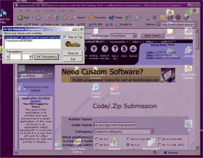

<div align="center">

## Make any app semi transparent


</div>

### Description

My boss walks past my screen all the time - I created this app so I at least had a chance of him not seeing what was on it!!! It was fun to write too! It's just alpha blending, but on any running application. Please vote and comment.
 
### More Info
 
Only win 2K and XP, sorry.


<span>             |<span>
---                |---
**Submitted On**   |2002-01-26 18:08:22
**By**             |[\[STi\] Fosters](https://github.com/Planet-Source-Code/PSCIndex/blob/master/ByAuthor/sti-fosters.md)
**Level**          |Intermediate
**User Rating**    |4.8 (58 globes from 12 users)
**Compatibility**  |VB 6\.0
**Category**       |[Complete Applications](https://github.com/Planet-Source-Code/PSCIndex/blob/master/ByCategory/complete-applications__1-27.md)
**World**          |[Visual Basic](https://github.com/Planet-Source-Code/PSCIndex/blob/master/ByWorld/visual-basic.md)
**Archive File**   |[Make\_any\_a514161272002\.zip](https://github.com/Planet-Source-Code/sti-fosters-make-any-app-semi-transparent__1-31255/archive/master.zip)

### API Declarations

```
Private Declare Function GetAsyncKeyState Lib "user32" (ByVal vKey As Long) As Integer
Private Declare Function CallWindowProc Lib "user32" Alias _
  "CallWindowProcA" (ByVal lpPrevWndFunc As Long, _
  ByVal hwnd As Long, ByVal Msg As Long, _
  ByVal wParam As Long, ByVal lParam As Long) As Long
Private Declare Function FindWindow Lib "user32" Alias "FindWindowA" (ByVal lpClassName As String, ByVal lpWindowName As String) As Long
Private Declare Function GetWindowLong Lib "user32" Alias "GetWindowLongA" (ByVal hwnd As Long, ByVal nIndex As Long) As Long
Private Declare Function SetWindowLong Lib "user32" Alias "SetWindowLongA" (ByVal hwnd As Long, ByVal nIndex As Long, ByVal dwNewLong As Long) As Long
Private Declare Function SetLayeredWindowAttributes Lib "user32" (ByVal hwnd As Long, ByVal crey As Byte, ByVal bAlpha As Byte, ByVal dwFlags As Long) As Long
Private Declare Function GetClassLong Lib "user32" Alias "GetClassLongA" (ByVal hwnd As Long, ByVal nIndex As Long) As Long
Private Declare Function GetClassName Lib "user32" Alias "GetClassNameA" (ByVal hwnd As Long, ByVal lpClassName As String, ByVal nMaxCount As Long) As Long
Private Declare Function GetCursorPos Lib "user32" (lpPoint As POINTAPI) As Long
Private Declare Function GetParent Lib "user32" (ByVal hwnd As Long) As Long
Private Declare Function GetWindowRect Lib "user32" (ByVal hwnd As Long, lpRect As RECT) As Long
Private Declare Function GetWindowRgn Lib "user32" (ByVal hwnd As Long, ByVal hRgn As Long) As Long
Private Declare Function GetWindowText Lib "user32" Alias "GetWindowTextA" (ByVal hwnd As Long, ByVal lpString As String, ByVal cch As Long) As Long
Private Declare Function GetWindowWord Lib "user32" (ByVal hwnd As Long, ByVal nIndex As Long) As Integer
Private Declare Function IsIconic Lib "user32" (ByVal hwnd As Long) As Long
Private Declare Function IsWindowEnabled Lib "user32" (ByVal hwnd As Long) As Long
Private Declare Function IsZoomed Lib "user32" (ByVal hwnd As Long) As Long
Private Declare Function ShellExecute Lib "shell32.dll" Alias "ShellExecuteA" (ByVal hwnd As Long, ByVal lpOperation As String, ByVal lpFile As String, ByVal lpParameters As String, ByVal lpDirectory As String, ByVal nShowCmd As Long) As Long
Private Declare Function WindowFromPoint Lib "user32" (ByVal xPoint As Long, ByVal yPoint As Long) As Long
```


